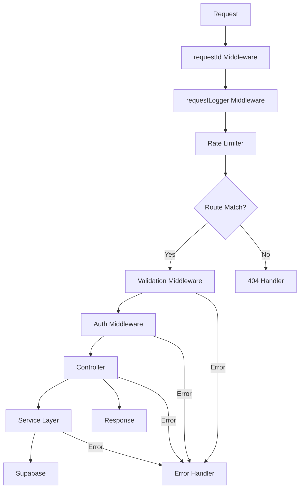

# Express API Production-Grade Upgrade Walkthrough

## Summary

Upgraded the Express API in `services/api` to production-grade quality. The passkey edge functions were already migrated - this work focused on adding proper error handling, validation, service layers, and documentation.

## What Was Done

### 1. Error Handling Infrastructure

Created a comprehensive error handling system:

- **[AppError.ts](file:///s:/DEV/project_delta/services/api/src/utils/AppError.ts)** - Custom error class with static factory methods for common HTTP errors
- **[asyncHandler.ts](file:///s:/DEV/project_delta/services/api/src/utils/asyncHandler.ts)** - Wrapper to catch async errors in route handlers
- **[errorHandler.ts](file:///s:/DEV/project_delta/services/api/src/middleware/errorHandler.ts)** - Global error handler with structured responses

### 2. Request Tracking & Logging

- **[requestId.ts](file:///s:/DEV/project_delta/services/api/src/middleware/requestId.ts)** - Generates unique request IDs for tracing
- **[requestLogger.ts](file:///s:/DEV/project_delta/services/api/src/middleware/requestLogger.ts)** - Logs all requests with duration tracking

### 3. Input Validation

Added Zod validation schemas for all endpoints:

| Module | File | Schemas |
|--------|------|---------|
| Auth | [auth.validation.ts](file:///s:/DEV/project_delta/services/api/src/modules/auth/auth.validation.ts) | WebAuthn credentials, email auth, Google auth |
| Sleep | [sleep.validation.ts](file:///s:/DEV/project_delta/services/api/src/modules/sleep/sleep.validation.ts) | Sleep log data, history params |
| Profile | [profile.validation.ts](file:///s:/DEV/project_delta/services/api/src/modules/profile/profile.validation.ts) | Profile updates, avatar upload |

### 4. Service Layer Separation

Separated database operations from controllers for better testability:

- **[sleep.service.ts](file:///s:/DEV/project_delta/services/api/src/modules/sleep/sleep.service.ts)** - Sleep data operations
- **[profile.service.ts](file:///s:/DEV/project_delta/services/api/src/modules/profile/profile.service.ts)** - Profile and avatar operations

### 5. Configuration Improvements

Updated [config/index.ts](file:///s:/DEV/project_delta/services/api/src/config/index.ts):
- Environment validation on startup
- Centralized passkey configuration
- Typed config object

### 6. Main Application Updates

Enhanced [index.ts](file:///s:/DEV/project_delta/services/api/src/index.ts):
- Request ID middleware
- Request logging
- Global error handler
- 404 handler
- Graceful shutdown handlers
- Unhandled rejection/exception handlers

## API Response Format

All responses now follow a consistent format:

**Success:**
```json
{
  "success": true,
  "data": { ... }
}
```

**Error:**
```json
{
  "success": false,
  "error": {
    "code": "ERROR_CODE",
    "message": "Human-readable message"
  },
  "requestId": "uuid-for-tracing"
}
```

## Documentation Added

- **[README.md](file:///s:/DEV/project_delta/services/api/README.md)** - Complete API documentation
- **[.env.example](file:///s:/DEV/project_delta/services/api/.env.example)** - Environment template

## Verification

```bash
cd services/api
npm run build
```

✅ **Build succeeded** - All TypeScript compiles without errors.

## Architecture Diagram



## Edge Functions Status

The edge functions in `services/supabase/functions` are deprecated and can be safely removed when ready. The mobile app already uses the Express API endpoints.
